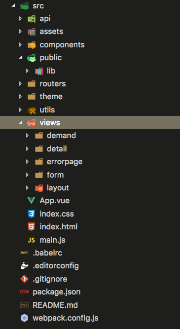

# 项目介绍

本后台管理系统是一套基于 **`webpack + vue + iview + adminlte.css`** 的前端框架，主要用于快速搭建一套可扩展的后台管理系统产品。

## 特性

 * 具备后台管理系统基本框架
 * 组件化
 * 可扩展
 * 可自定义主题
 * 实现无刷新页面跳转
 * 通过node-cli实现代码无污染管理

## 项目结构
 

 进入项目根目录之后我们使用npm intsall命令安装所有依赖，所有的依赖被声明在package.json文件中。文件index.html中包含了如下HTML代码：
 ```
 <!DOCTYPE html>
<html lang="en">

<head>
    <meta charset="utf-8">
    <title>webpack-demo</title>
    <!-- 第三方css样式引入 -->

</head>

<body class="sidebar-mini skin-black fixed">
    <div id="app"></div>
    <!-- jq ,sdk,第三方脚本引入 -->
</body>

</html>
 ```
该文件是整个应用的入口点，注意，无论你把`<div>`元素放在哪，只要保证其id属性为app即可，该元素是整个由Vue.js生成文件的插入点。然后我们看下src文件夹中的main.js文件，该文件是Vue应用初始化的地方：
```javascript
import Vue from 'vue'; //Vue是整个框架的主类
import VueRouter from 'vue-router'; //VueRouter是框架的路由管理器
import iView from 'iview'; //iView是项目的ui组件库
import router from './routers'; //router是项目路由配置
import App from './App.vue'; //App是整个应用的根元素
import './theme/index.less'; //用来控制页面iview组件的样式主题
import './index.css'; //是页面主要自定义样式
import Common from './utils/common'; //Common是项目公共功能方法
import permission from './utils/permission'; //permission是项目的权限管理

permission.bindChangePage(); //执行路由跳转的权限函数
window.Common = Common; //把Common挂载到window下面
Common.init(); //初始化Common

//注入VueRouter和iView
Vue.use(VueRouter);
Vue.use(iView);

export function render() {
    //使用new关键字能够创建Vue的实例，构造函数会接收包含三个属性的配置对象。
    new Vue({
        el: '#app', //Vue应用的容器节点
        router, //挂载根路由
        render: h => h(App) //渲染vue组件
    })
}

// 判断用户是否登录
Common.isLogin(function(res) {
    if (res) {
        // 已登录，渲染页面
        render();
    } else {
        // 未登录，唤起登录
        Common.login();
    }
})
```
整个App组件的的定义在App.vue文件中.对于每个Vue.js 单文件组件，其会包含三部分：
  * `<style></style>`
  * `<template></template>`
  * `<script></script>`

由于我们的框架运用了adminlte.css，几乎不需要重写样式，所以我们的组件只有template和script。

```
<template>
    <div class="layout">
        <MyHeader :userInfo="userInfo" />
        <aside class="main-sidebar">
            <sidebar-menu :router="router()" />
        </aside>
        <div class="content-wrapper">
            <bread-crumb/>
            <div class="content">
                <router-view></router-view>
            </div>
        </div>
    </div>
</template>

<script>
    import MyHeader from './components/header/MyHeader.vue';
    import sidebarMenu from './components/sider/sidebarMenu.vue';
    import breadCrumb from './components/Breadcrumb';
    import permission from './utils/permission';
    import menuRouter from './routers/menu';
    import directive from './utils/directive'
    //export 导出了app组件
    export default {
        data() {
            return {
                isCollapsed: false,
                userInfo: null
            }
        },
        //声明了对于MyHeader,sidebarMenu,breadCrumb组件的引用
        components: {
            MyHeader,
            sidebarMenu,
            breadCrumb
        },
        //实例创建前：这个阶段实例的data、methods是读不到的
        beforeCreate() {
            f2eGame.port.udb.getUserInfo().then((res) => {
                this.userInfo = res;
            });
        },
        //实例被创建之后：这个阶段已经完成了数据观测(data observer)，
        //属性和方法的运算， watch/event 事件回调。
        //mount挂载阶段还没开始，$el 属性目前不可见，数据并没有在DOM元素上进行渲染
        created() {
            console.log(Common)
        },
        //这个状态下数据更新并且DOM重新渲染，
        //当这个生命周期函数被调用时，组件 DOM 已经更新，
        //所以你现在可以执行依赖于 DOM 的操作。
        //当实例每次进行数据更新时updated都会执行
        updated() {
    
        },
        methods: {
            router(){
                return permission.updateMenulist(menuRouter)
            },
        }
    }
</script>


```
