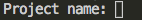
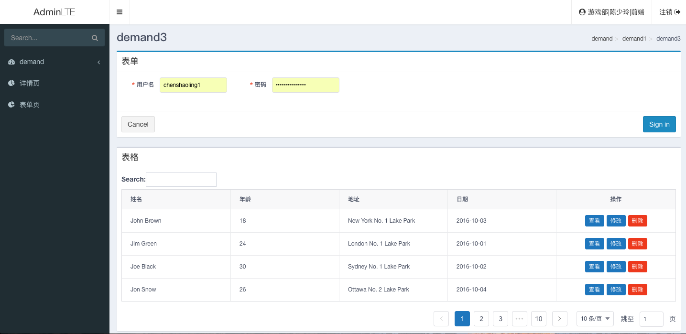

# 开发步骤

### 初始化项目
  环境安装完毕之后，我们可以使用如下方式来初始化新的项目：（命令行会在当前文件夹新建项目，建议先打开项目要存放位置的路径） 

  > `f2egame-admin init`

  命令行会出现一个输入提示，询问项目的名称（这里简单处理成项目文件夹名称）

  

  输入你的项目名称，比如‘test’，回车，就开始以仓库模板创建新的项目，并且这个新项目取名为test。命令行中打印 success 代表下载成功,项目的模板文件被添加到了test目录下。

### 安装依赖

打开本地项目test根目录，在命令行中输入：
> ` npm i `

根目录下会产生一个node_modules的文件夹，存放下载的依赖。

### 启动开发服务器

> ` npm run dev `

该命令会启动一个监听80端口的开发服务器，在浏览器中打开该端口可以看到如下界面。(可以在浏览器中实时查看修改结果,记得要把本地host改成yy域，才不会影响页面登录和接口相关的功能。)

### 发布

>` npm run build `

运行命令之后，会在项目根目录下生成一个dist文件夹，里面是打包之后的代码和资源,可以直接发布到升龙系统。其中里面的public文件夹是和src里面的public是一样的，public的资源不会压缩，所以直接在index.html中通过link或者script引用的资源可以放在public里面。css文件夹存放样式，js文件夹存放脚本，还有一个html入口。
